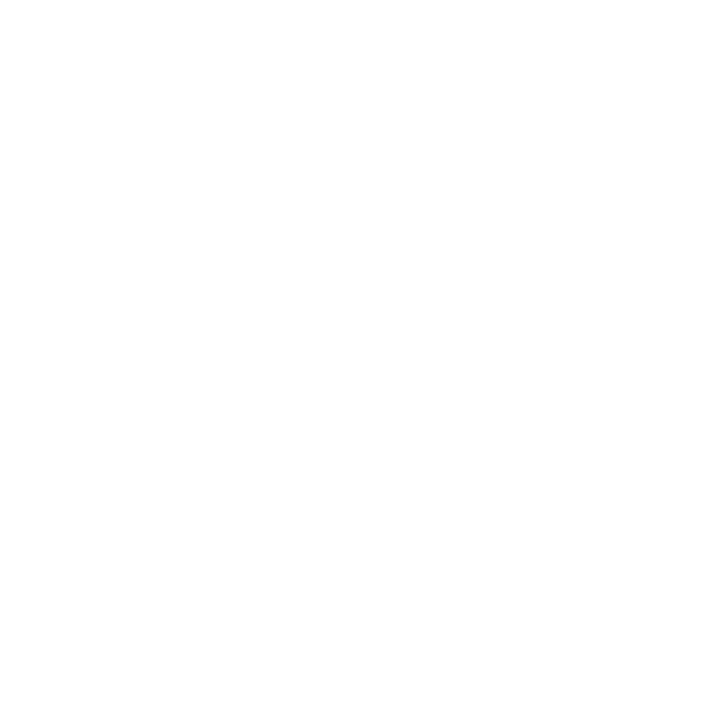
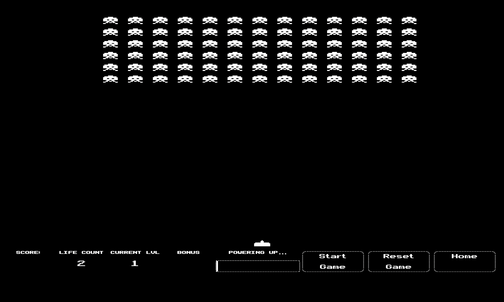
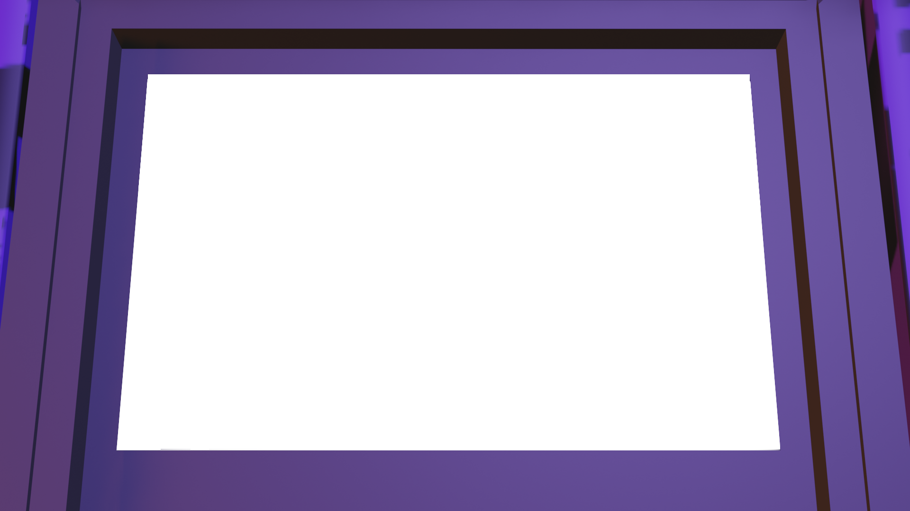
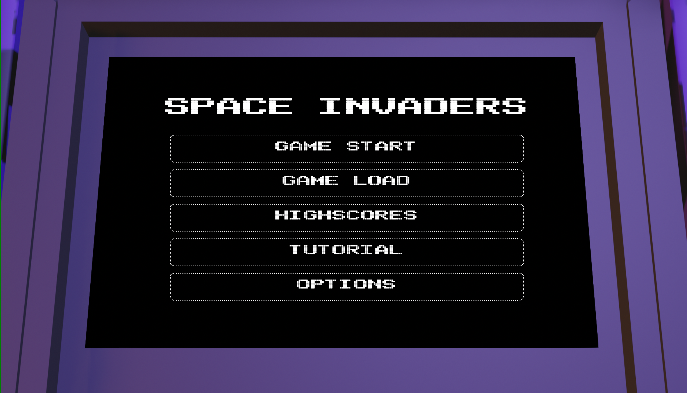
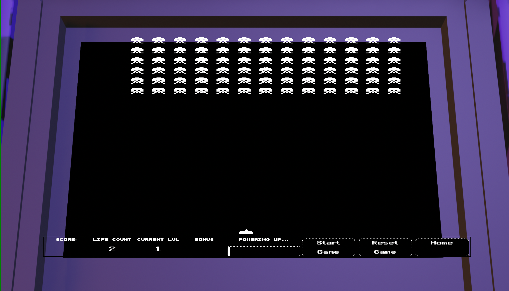
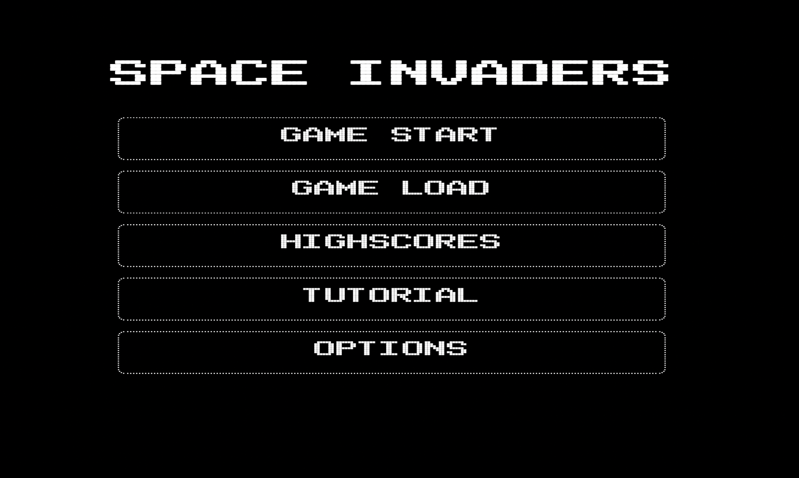

#  Space Invaders 
> SEI Project One

The goal of this project was to create a grid-based JavaScript game. The game I decided to create was Space Invaders. The requirements as stipulated in the brief were as follows:
1) The player should be able to clear at least one wave of aliens
2) The player's score should be displayed at the end of the game


  []("https://jedwardsk.github.io/sei-project-one/")
  ><small>Click the image for a link to the deployed project</small>

## Technologies Used
- HTML5
- CSS3
- JavaScript
- Blender 2.93

## Process:

As a starting point, I broke down the elements of the game that I would need to implement. Working with the brief and examining the original Space Invaders game, I started by determining what the minimum requirements for basic functionality to deliver a recognisable Space Invaders experience:
- The player can only move left or right.
- The aliens also move from left to right, and also down each time they reach the side of the screen.
- If the player clears all enemies before they reach the bottom of the game board, they win (WIN STATE, brief deliverable 1)
- If the aliens reach the bottom of the game board it is game over(LOSE STATE)
- The player gains points per enemy destroyed. At the end of the game they can view their score (brief deliverable 2)

Additional features considered were
- Difficulty
 - Enemies shoot back at random intervals. Player has a life counter. if that reaches zero, the game ends (LOSE STATE)
 - Enemies speed increases as the player clears the board
- Player Extras
 - Special enemy types that give the player a boosted score
 - Different weapon types based on certain modifiers
- User Experience
 - Different game Screens
 - Ability to save highscores


### Functionality

I started off with placeholder icons and images to render the actions, before implementing the design. The board was through a function that generated `<div>` elements
```javascript
const width = 20
const height = 20
const cellCount = width * height

function createGrid() {
   for (let i = 0; i < cellCount; i++) {
     const cell = document.createElement('div')
     // cell.innerText = i
     grid.appendChild(cell)
     cells.push(cell)
   }
   addCharacter(playerStartingPosition, playerClass)
   addEnemyRow()
 }
```
Player and Enemy characters moved about the grid through the assignment and removal of class names to the grid positions. The class names specified a background image that would depict the required game element. For example, for the player character

```css
.playerCharacter{
 background-image: url('../assets/playerShip.png');
 background-repeat: no-repeat;
 background-size: contain;
 background-position: center;
 cursor: none;
}
```
#### Board Setup
The game's setup was handled by  the following functions:
- `function createGrid()` to handle the grid generation
- `addCharacter(position, characterType)` to handle the placement of the player character
- `enemyRow()` to handle the creation of the enemy characters, using `addCharacter()` in a loop to generate multiple enemies in formation

As seen above, I called the `addCharacter()` and `enemyRow()` functions inside the `createGrid()` function so they would run together. alternatively, as separate `gameCreate()` function could have handled all three.

#### Player movement

I wanted to allow the player to move either through the directional arrows or WASD keys, and to shoot with the spacebar.

Movement was handled by three functions:
- `addCharacter(position, characterType)` handled adding the class 'playerCharacter' (this function was reusable for all charactertypes)
- `removeCharacter(position, character)` handled removing the player class
- `characterMovement(key)` run with an event listener to act based on certain keypresses. If the player pressed the left arrow or 'A' they moved left, and right if they pressed the right arrow or the 'D' key, up to the boundaries of the grid.

#### Player actions

Player combat was handled by the following functions:
- `characterMoveSet(key)` determined which weapon was being fired
- `useWeapon()` determined how to render the weapon action on the board


#### Enemy Movement

Enemy movement had to be handled slightly differently to the player's. rather than listening for a keypress, they had to move based on time. As such, their movement was handled through an interval.

The aliens all moved to the right, until they hit the boundary, at which point they moved down one and reversed their direction, repeating this until they reached the bottom of the screen.

Put more simply the steps were as follows:
1) define variables for boundaries (`isBoundary()` and `isFloor()`, both output Booleans) and the direction (starting `let direction = 1`
2)remove enemyClass class names from current positions
3) dependant on direction, +/- 1 to current position
4) add enemyClass class names to new position
5) if the enemy class is at the boundary (`isBoundary() === true`) add `cell.width` to current position (to move them down a row) and change the direction value to its opposite i.e. `direction = direction * -1`
6) if `isFloor() === true` it's game over!


#### Win/Lose conditions

As mentioned above the lose condition is handled when `isFloor() === true`. For the win condition, the player needs to remove aliens from the game. Breaking this element down I considered the following:

- the interaction between the player's weapon and the enemy - a collision
- When does the collision occur and how is this fed back to the player
- how to track the score for the player (brief deliverable 2)

The following functions were used to achieve the above considerations:
- `addCharacter(position, characterType)`
- `removeCharacter(position, character)`
- `enemyRemainingCheck()`

The collision was inside `characterMoveset()`. When a `<div>` had `class="weaponBolt enemyClass"` this was a hit. When this occurred, both classes were removed and a new class `explosion` was assigned.

The enemy had to be removed permanently. As the aliens were part of an array, this was achieved by filtering out that position from the array

```javascript
enemyCurrentPosition = enemyCurrentPosition.filter(
 (item) => item !== weaponCurrentPosition
)
```

An interval running in the global scope periodically checked all cells for `(cell.classList.value === explosion)` and removed the class if true. This simulated the explosion disappearing over time.

The player score counter simply declared two variables, `scoreCounter` and `scoreModifier`. If there was a collision, the score was increased by `scoreCounter += scoreModifier1`.


The score was then updated on the screen by updating a `displayScore' html element

```javascript
displayScore.innerHTML = scoreCounter
```

Finally `enemyRemainingCheck()` checked the enemy array's length. if `enemyCurrentPosition.length === 0`, all the enemies are destroyed and the player wins!

### Design


For the design, I attempted a retro arcade-style. I searched for space invaders icons using an image search engine and adjusted the colours where necessary using Preview on Mac.

#### Arcade Machine

I also wanted to style the background as though the game was being played on an arcade machine. For this i made a model arcade machine using Blender, and animated a short turnaround of  the model to be used on page load.

<div><video src="./assets/splashVideo.mp4" alt="Arcade machine animation" controls loop width="300"></div>

I intended for the final frame to transition into the background image and frame the game's grid.




However I couldn't get the video to play and had problems with the positioning to contain the game screen


#### Game Pages
Rather than having the game screen visible immediately, I made different screens:

- a Home Screen
- a Tutorial Screen
- Win/ Lose State Screens
- an Options Screen
- Highscore and Load Game Screens



The Highscore, Game Load and Options Screens did not have functionality by the end of the project, but were created to allow for expansion either as stretch goals or in the future.

```javascript
 function toTutorial() {
   splashScreen.classList.add('hidden')
   tutorialScreen.classList.remove('hidden')
 }

tutorialButton.addEventListener('click', toTutorial)
```

The screens were all given a class of 'hidden'. This class had the attribute display: none. Eventlistener's were added to specific buttons that would add or remove the class to screens on click.


## Added Functionality Attempts

### Weapon Powerup (partially implemented)
I added an additional bonus weapon, a bomb, that the player would earn based on a defined number of enemies killed.

#### Updating `useWeapon()` to `useWeapon(weapon)`
The function was updated to include a parameter to specify which weapon is in use.
- a weapon power up that destroys enemies in a specific pattern, such as all the enemies in the row, column or surrounding enemies.
#### Updating `characterMoveset(keyPress)`
I decided to set the powerup to be used on press of the 'P' key. I additionally wanted to only allow its use when a set number of enemies had been killed. I defined two variables
- the target  `const powerUpCharge = 4` and
- the counter `let powerUpCounter = 0`

Then the following condition allowed use of the bomb
```javascript
else if (key === 80 && powerUpCounter >= powerUpCharge) {
 useWeapon('bomb')
 powerUpCounter = 0
}
```

#### New `powerupTracker()` function
This function handled how display to the player that the powerup was ready:

```javascript
function powerupTracker() {
 if (isPowerupReady === powerUpCharge) {
   bonusDisplay.innerText = 'BOMB'
 }
}
```

Lines were added to `characterMoveset()` to reset the visual display for the player.
```javascript
else if (key === 80 && powerUpCounter >= powerUpCharge) {
 useWeapon('bomb')
 powerUpCounter = 0
 powerBar.value = 0
     bonusDisplay.innerText = ' '
}
```
I wanted to have the weapon destroy all the surrounding enemies or some other pattern, but was not able to implement it in the time allocated. The current state is shown below.

<div><video src="./assets/readME/bombDemo.mp4" alt="Arcade machine animation" autoplay loop width="300"></div>

### Bonus Enemy (implemented with bugs)
I wanted to have bonus ships appear at random intervals that could be shot down for extra points/ different weapon powerups.

I attempted this with an interval, which worked at some stage, but currently is not working correctly. UFOs remain on the screen and multiple UFOs are present.

<div><video src="./assets/readME/demoUFOBug.mp4" autoplay loop alt="a demo of the UFO bug" width="300"></div>

This could be fixed in the future perhaps by adding a `isUFOOnScreen` Boolean variable and only run the interval if false. The variable would change state when either the player shoots it down, or the UFO reaches cell position 1.

### Enemy Actions (not implemented - bugs)
Having enemies firing back adds difficulty and an extra LOSE STATE i.e health reaching zero. for this to function
- life counter variables
- `enemyWeaponFire()` function
- collision checks for two states
 - player and enemy weapon
 - player weapon and enemy weapon

Collisions were handled in the same way as with the player weapons; if the cell has the two classes, both were removed and the explosion class was assigned.

If the collision was with the player and the enemy weapon, depending on the settings, if only one shot is required


### Movement Speed (not implemented)
Space Invaders movement was an unintended quirk where removing a sprite freed the processor. The extra processing time meant that the remaining enemies moved faster

Trying to implement this my design, I thought that i could set an interval that's speed was determined based on a fraction

```javascript
function increaseSpeed() {
   const speedFraction = 1000 / enemyStartingPosition.length
   let speed = 1000
   let compareLength = enemyStartingPosition.length
   const reduceSpeedNumber = setInterval(() => {
     if (enemyCurrentPosition.length - 1 === compareLength) {
       speed -= speedFraction
       compareLength = enemyCurrentPosition.length
     }

     if (speed === 0) {
       clearInterval(reduceSpeedNumber)
     }
   }, 100)
 }
 ```


## Known Errors
 - cannot play video for opening splash screen
 - no sound
 - enemies shooting back
 - enemies moving crazy at certain point
 - UFO doesn't disappear, multiple appear on screen
 - game


## Learning Outcomes

### Wins/ Challenges
There were small wins and challenges throughout the project, some of the challenges have been mentioned in the Known Bugs and Added Functionality Attempts sections.

Overall I gained more confidence and understanding of the technologies learnt, and look forward to both coming back and fixing bugs, adding features, or starting similar projects

To highlight two, the first was with using media, audio and video. During development I used the  Live Share extension in VSCode, neglecting to check for regularly in the browser. When it came to deployment, I only then realised issues with my implementation

Another problem was with scaling problems. Things would work at their most simple state, but ensuring that the code is written in a way that it holds when scaled. For example, if during testing I made the  initial grid a 10x10 square, or only tried weapon use with one enemy

### Future Improvements
 - differing enemy movement speed based on enemies remaining
 - bonus levels
 - saving data to local storage to allow for high score/ game continue
 - having options for game settings, such as difficulty, number of powerups, bonuses etc


